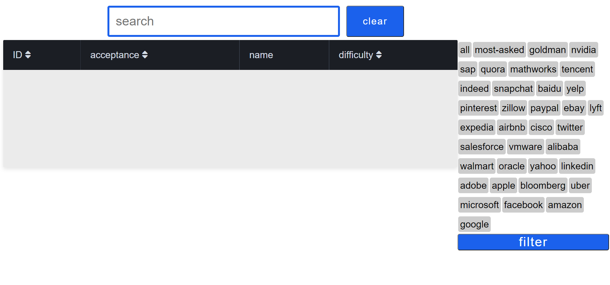
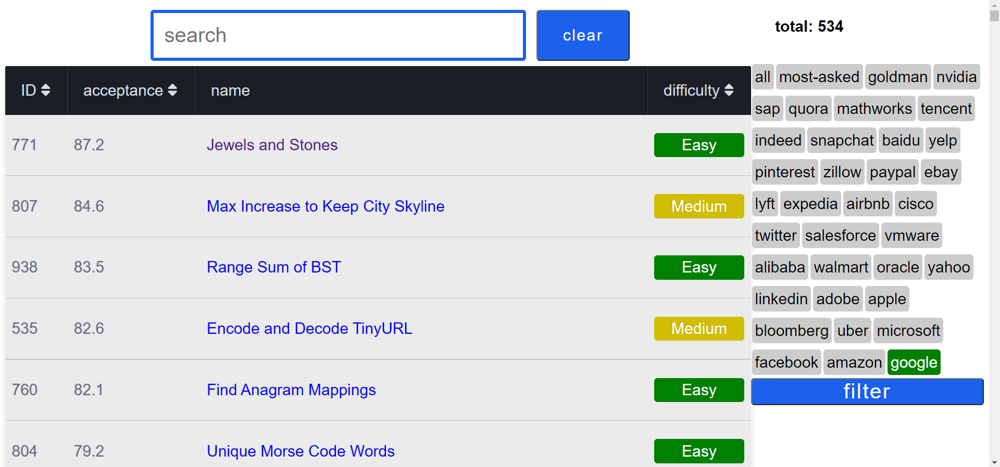
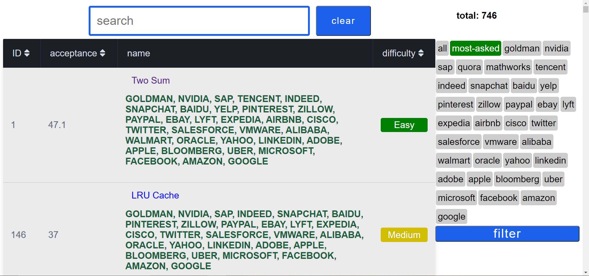

<h1>leetcode-scraping</h1>
<h3>scrap leetcode questions </h3>
 

<h3>functionalities</h3>
<ul>
  <li><h4>filter questions based on specific company or most asked or all of them </h4></li>
  <li><h2>search the questions </h2></li>
  <li>sort them based on: 
    <ul>
      <li> Id</li>
      <li> acceptance rate</li>
      <li> difficulty</li>
    </ul>
  </li>

</ul>

